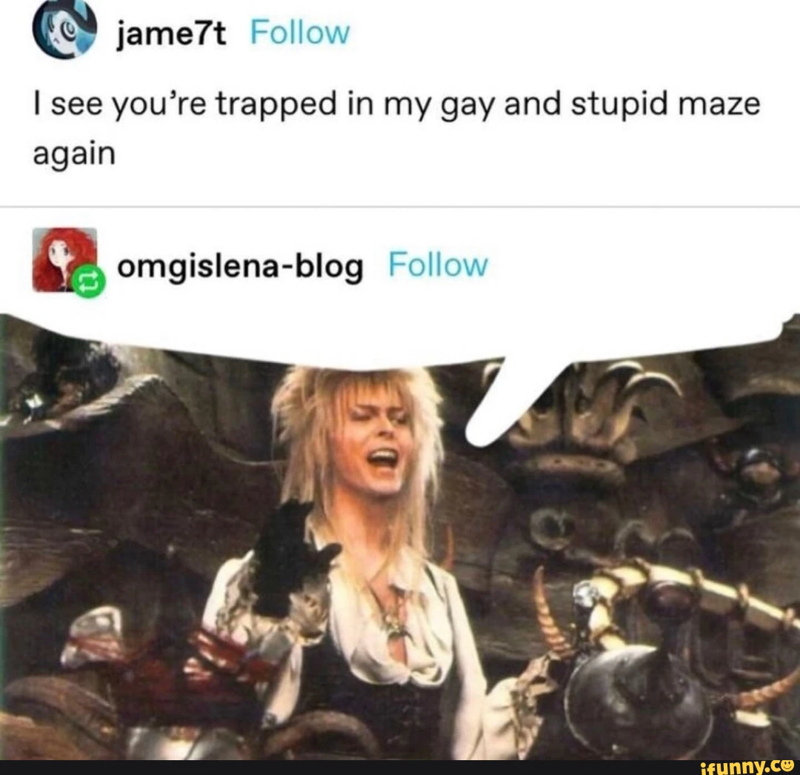
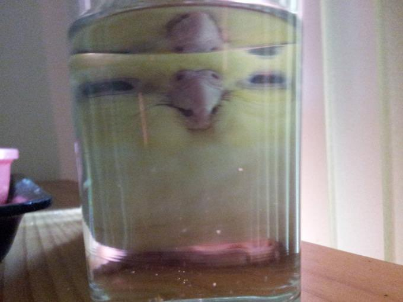

# I-see-you-re-trapped-in-my-gay-and-stupid-code-again
gay, gay, homosexual, gay

---
Greetings, strangers, friends, and fellow gays!
 Can you solve my gay and stupid maze?
---
# Your first task I give to thee:
## Find the javascript file in this repository!
---
Your task of number two:
Open [this tab][the tab in question] anew
Perhaps leave it a friendly review?
---
The task of the third:
Look at this funny bird!

---
The trial of the fourth!
Download the extension from earlier, do not remorthe!
Paste file into extension, hold your horthe:
For one final trial makes your courthe!

Final trial is here!
Consider who annoys you best,
grab the tag of your pesky pest,
and stuff it into `blacklistedTags`'s rear *(wrapped in quotations, separated by commas from the others)*
and your vexer shall disappear!

*(Hint: For instance, Lucy's tag is hashtag bee, capital ee, pea, for gee, capital dee, lowercase eye ate. In other words, zl gnt or #oRc4tQv8, so if you wanted to blacklist me, Lucy, you would change `blacklistedTags` to `ine oynpxyvfgrqGntf = ["#oRc4tQv8"]`)*

[the tab in question]: https://addons.mozilla.org/en-US/firefox/addon/javascript/
